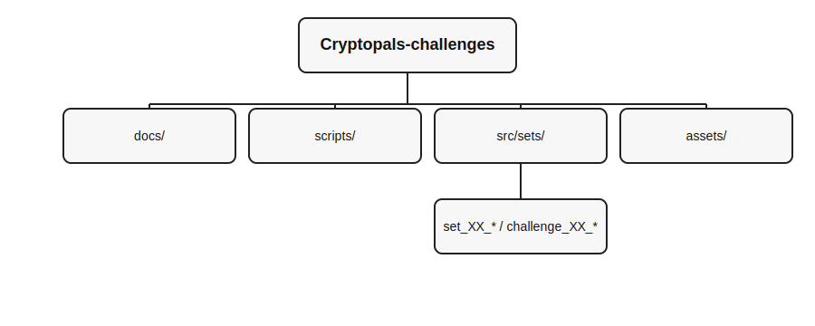

# Cryptopals Challenges (Python)


> Refactored and organized solutions for the Cryptopals crypto challenges, with per-challenge writeups and a launcher.



## At a glance
- 66 challenges tracked across 8 sets.
- 54 challenges have a working implementation.
- Per-challenge folders in `src/sets/` with scripts, data files, and `writeup.md`.
- `scripts/run_challenge.py` runs single or multi-step challenges in order.
- `scripts/verify_project.py` checks structure, data files, and syntax.

## Quickstart

Python 3.9+ recommended.

Windows (PowerShell)
```powershell
python -m venv .venv
.\.venv\Scripts\activate
pip install -r requirements.txt
```

macOS/Linux
```bash
python3 -m venv .venv
source .venv/bin/activate
pip install -r requirements.txt
```

## Running

List challenges:
```powershell
python scripts/run_challenge.py --list
```

Run a challenge by number:
```powershell
python scripts/run_challenge.py 1
python scripts/run_challenge.py 34
```

Run a single script within a multi-script challenge:
```powershell
python scripts/run_challenge.py 34 --script server.py
```

The runner launches multi-process challenges in the correct order (server -> attacker -> client where applicable).
Some scripts bind to localhost ports (often 8820/8821), so run them one at a time.

If you want to run a script directly, set `PYTHONPATH=src` or use `python -m` with the module path.

## Documentation

- `docs/index.md` for the documentation overview.
- `docs/challenges.md` for the full index of scripts, writeups, and data files.
- `docs/legacy_writeup.md` for the original notes.
- `src/sets/**/writeup.md` for each challenge writeup.

## Project layout

- `src/sets/` : per-set, per-challenge folders.
- `docs/` : indexes and supporting documentation.
- `scripts/` : challenge runner and verification helper.
- `assets/` : diagrams and presentation assets.
- `requirements.txt` : Python dependencies.
- `LICENSE.md`

## Challenge Table

Legend: [x] implemented, [ ] not implemented. Video links appear when available.

| Challenge | Cryptopals | Code | Writeup | Video | Status |
| --- | --- | --- | --- | --- | --- |
| 01 - Convert hex to base64 | [cryptopals](https://cryptopals.com/sets/1/challenges/1) | [hex_to_base64.py](src/sets/set_01_basics/challenge_01_hex_to_base64/hex_to_base64.py) | [writeup](src/sets/set_01_basics/challenge_01_hex_to_base64/writeup.md) | - | [x] implemented |
| 02 - Fixed XOR | [cryptopals](https://cryptopals.com/sets/1/challenges/2) | [fixed_xor.py](src/sets/set_01_basics/challenge_02_fixed_xor/fixed_xor.py) | [writeup](src/sets/set_01_basics/challenge_02_fixed_xor/writeup.md) | - | [x] implemented |
| 03 - Single-byte XOR cipher | [cryptopals](https://cryptopals.com/sets/1/challenges/3) | [single_byte_xor_cipher.py](src/sets/set_01_basics/challenge_03_single_byte_xor_cipher/single_byte_xor_cipher.py) | [writeup](src/sets/set_01_basics/challenge_03_single_byte_xor_cipher/writeup.md) | - | [x] implemented |
| 04 - Detect single-character XOR | [cryptopals](https://cryptopals.com/sets/1/challenges/4) | [detect_single_character_xor.py](src/sets/set_01_basics/challenge_04_detect_single_character_xor/detect_single_character_xor.py) | [writeup](src/sets/set_01_basics/challenge_04_detect_single_character_xor/writeup.md) | - | [x] implemented |
| 05 - Implement repeating-key XOR | [cryptopals](https://cryptopals.com/sets/1/challenges/5) | [repeating_key_xor.py](src/sets/set_01_basics/challenge_05_repeating_key_xor/repeating_key_xor.py) | [writeup](src/sets/set_01_basics/challenge_05_repeating_key_xor/writeup.md) | - | [x] implemented |
| 06 - Break repeating-key XOR | [cryptopals](https://cryptopals.com/sets/1/challenges/6) | [break_repeating_key_xor.py](src/sets/set_01_basics/challenge_06_break_repeating_key_xor/break_repeating_key_xor.py) | [writeup](src/sets/set_01_basics/challenge_06_break_repeating_key_xor/writeup.md) | - | [x] implemented |
| 07 - AES in ECB mode | [cryptopals](https://cryptopals.com/sets/1/challenges/7) | [aes_ecb_mode.py](src/sets/set_01_basics/challenge_07_aes_ecb_mode/aes_ecb_mode.py) | [writeup](src/sets/set_01_basics/challenge_07_aes_ecb_mode/writeup.md) | - | [x] implemented |
| 08 - Detect AES in ECB mode | [cryptopals](https://cryptopals.com/sets/1/challenges/8) | [detect_aes_ecb_mode.py](src/sets/set_01_basics/challenge_08_detect_aes_ecb_mode/detect_aes_ecb_mode.py) | [writeup](src/sets/set_01_basics/challenge_08_detect_aes_ecb_mode/writeup.md) | - | [x] implemented |
| 09 - Implement PKCS#7 padding | [cryptopals](https://cryptopals.com/sets/2/challenges/9) | [pkcs7_padding.py](src/sets/set_02_block_crypto/challenge_09_pkcs7_padding/pkcs7_padding.py) | [writeup](src/sets/set_02_block_crypto/challenge_09_pkcs7_padding/writeup.md) | - | [x] implemented |
| 10 - Implement CBC mode | [cryptopals](https://cryptopals.com/sets/2/challenges/10) | [cbc_mode.py](src/sets/set_02_block_crypto/challenge_10_cbc_mode/cbc_mode.py) | [writeup](src/sets/set_02_block_crypto/challenge_10_cbc_mode/writeup.md) | - | [x] implemented |
| 11 - An ECB/CBC detection oracle | [cryptopals](https://cryptopals.com/sets/2/challenges/11) | [ecb_cbc_detection_oracle.py](src/sets/set_02_block_crypto/challenge_11_ecb_cbc_detection_oracle/ecb_cbc_detection_oracle.py) | [writeup](src/sets/set_02_block_crypto/challenge_11_ecb_cbc_detection_oracle/writeup.md) | - | [x] implemented |
| 12 - Byte-at-a-time ECB decryption (simple) | [cryptopals](https://cryptopals.com/sets/2/challenges/12) | [byte_at_a_time_ecb_simple.py](src/sets/set_02_block_crypto/challenge_12_byte_at_a_time_ecb_simple/byte_at_a_time_ecb_simple.py) | [writeup](src/sets/set_02_block_crypto/challenge_12_byte_at_a_time_ecb_simple/writeup.md) | - | [x] implemented |
| 13 - ECB cut-and-paste | [cryptopals](https://cryptopals.com/sets/2/challenges/13) | [ecb_cut_and_paste.py](src/sets/set_02_block_crypto/challenge_13_ecb_cut_and_paste/ecb_cut_and_paste.py) | [writeup](src/sets/set_02_block_crypto/challenge_13_ecb_cut_and_paste/writeup.md) | - | [x] implemented |
| 14 - Byte-at-a-time ECB decryption (harder) | [cryptopals](https://cryptopals.com/sets/2/challenges/14) | [byte_at_a_time_ecb_harder.py](src/sets/set_02_block_crypto/challenge_14_byte_at_a_time_ecb_harder/byte_at_a_time_ecb_harder.py) | [writeup](src/sets/set_02_block_crypto/challenge_14_byte_at_a_time_ecb_harder/writeup.md) | - | [x] implemented |
| 15 - PKCS#7 padding validation | [cryptopals](https://cryptopals.com/sets/2/challenges/15) | [pkcs7_padding_validation.py](src/sets/set_02_block_crypto/challenge_15_pkcs7_padding_validation/pkcs7_padding_validation.py) | [writeup](src/sets/set_02_block_crypto/challenge_15_pkcs7_padding_validation/writeup.md) | - | [x] implemented |
| 16 - CBC bitflipping attacks | [cryptopals](https://cryptopals.com/sets/2/challenges/16) | [cbc_bitflipping.py](src/sets/set_02_block_crypto/challenge_16_cbc_bitflipping/cbc_bitflipping.py) | [writeup](src/sets/set_02_block_crypto/challenge_16_cbc_bitflipping/writeup.md) | - | [x] implemented |
| 17 - The CBC padding oracle | [cryptopals](https://cryptopals.com/sets/3/challenges/17) | [cbc_padding_oracle.py](src/sets/set_03_block_and_stream_crypto/challenge_17_cbc_padding_oracle/cbc_padding_oracle.py) | [writeup](src/sets/set_03_block_and_stream_crypto/challenge_17_cbc_padding_oracle/writeup.md) | - | [x] implemented |
| 18 - Implement CTR mode | [cryptopals](https://cryptopals.com/sets/3/challenges/18) | [aes_ctr_mode.py](src/sets/set_03_block_and_stream_crypto/challenge_18_aes_ctr_mode/aes_ctr_mode.py) | [writeup](src/sets/set_03_block_and_stream_crypto/challenge_18_aes_ctr_mode/writeup.md) | - | [x] implemented |
| 19 - Break fixed-nonce CTR mode using substitutions | [cryptopals](https://cryptopals.com/sets/3/challenges/19) | [break_fixed_nonce_ctr.py](src/sets/set_03_block_and_stream_crypto/challenge_19_break_fixed_nonce_ctr/break_fixed_nonce_ctr.py) | [writeup](src/sets/set_03_block_and_stream_crypto/challenge_19_break_fixed_nonce_ctr/writeup.md) | - | [x] implemented |
| 20 - Break fixed-nonce CTR statistically | [cryptopals](https://cryptopals.com/sets/3/challenges/20) | [break_fixed_nonce_ctr_statistical.py](src/sets/set_03_block_and_stream_crypto/challenge_20_break_fixed_nonce_ctr_statistical/break_fixed_nonce_ctr_statistical.py) | [writeup](src/sets/set_03_block_and_stream_crypto/challenge_20_break_fixed_nonce_ctr_statistical/writeup.md) | - | [x] implemented |
| 21 - Implement the MT19937 Mersenne Twister RNG | [cryptopals](https://cryptopals.com/sets/3/challenges/21) | [mt19937_rng.py](src/sets/set_03_block_and_stream_crypto/challenge_21_mt19937_rng/mt19937_rng.py) | [writeup](src/sets/set_03_block_and_stream_crypto/challenge_21_mt19937_rng/writeup.md) | - | [x] implemented |
| 22 - Crack an MT19937 seed | [cryptopals](https://cryptopals.com/sets/3/challenges/22) | [crack_mt19937_seed.py](src/sets/set_03_block_and_stream_crypto/challenge_22_crack_mt19937_seed/crack_mt19937_seed.py) | [writeup](src/sets/set_03_block_and_stream_crypto/challenge_22_crack_mt19937_seed/writeup.md) | - | [x] implemented |
| 23 - Clone an MT19937 RNG from its output | [cryptopals](https://cryptopals.com/sets/3/challenges/23) | [clone_mt19937.py](src/sets/set_03_block_and_stream_crypto/challenge_23_clone_mt19937/clone_mt19937.py) | [writeup](src/sets/set_03_block_and_stream_crypto/challenge_23_clone_mt19937/writeup.md) | - | [x] implemented |
| 24 - Create the MT19937 stream cipher and break it | [cryptopals](https://cryptopals.com/sets/3/challenges/24) | [mt19937_stream_cipher.py](src/sets/set_03_block_and_stream_crypto/challenge_24_mt19937_stream_cipher/mt19937_stream_cipher.py) | [writeup](src/sets/set_03_block_and_stream_crypto/challenge_24_mt19937_stream_cipher/writeup.md) | - | [x] implemented |
| 25 - Break random-access read/write AES CTR | [cryptopals](https://cryptopals.com/sets/4/challenges/25) | [break_random_access_aes_ctr.py](src/sets/set_04_stream_crypto_and_randomness/challenge_25_break_random_access_aes_ctr/break_random_access_aes_ctr.py) | [writeup](src/sets/set_04_stream_crypto_and_randomness/challenge_25_break_random_access_aes_ctr/writeup.md) | - | [x] implemented |
| 26 - CTR bitflipping | [cryptopals](https://cryptopals.com/sets/4/challenges/26) | [ctr_bitflipping.py](src/sets/set_04_stream_crypto_and_randomness/challenge_26_ctr_bitflipping/ctr_bitflipping.py) | [writeup](src/sets/set_04_stream_crypto_and_randomness/challenge_26_ctr_bitflipping/writeup.md) | - | [x] implemented |
| 27 - Recover the key from CBC with IV=Key | [cryptopals](https://cryptopals.com/sets/4/challenges/27) | [recover_key_from_iv_equal_key.py](src/sets/set_04_stream_crypto_and_randomness/challenge_27_recover_key_from_iv_equal_key/recover_key_from_iv_equal_key.py) | [writeup](src/sets/set_04_stream_crypto_and_randomness/challenge_27_recover_key_from_iv_equal_key/writeup.md) | - | [x] implemented |
| 28 - Implement a SHA-1 keyed MAC | [cryptopals](https://cryptopals.com/sets/4/challenges/28) | [sha1_keyed_mac.py](src/sets/set_04_stream_crypto_and_randomness/challenge_28_sha1_keyed_mac/sha1_keyed_mac.py) | [writeup](src/sets/set_04_stream_crypto_and_randomness/challenge_28_sha1_keyed_mac/writeup.md) | - | [x] implemented |
| 29 - Break a SHA-1 keyed MAC using length extension | [cryptopals](https://cryptopals.com/sets/4/challenges/29) | [sha1_length_extension.py](src/sets/set_04_stream_crypto_and_randomness/challenge_29_sha1_length_extension/sha1_length_extension.py) | [writeup](src/sets/set_04_stream_crypto_and_randomness/challenge_29_sha1_length_extension/writeup.md) | - | [x] implemented |
| 30 - Break an MD4 keyed MAC using length extension | [cryptopals](https://cryptopals.com/sets/4/challenges/30) | [md4_length_extension.py](src/sets/set_04_stream_crypto_and_randomness/challenge_30_md4_length_extension/md4_length_extension.py)<br>[md5_length_extension.py](src/sets/set_04_stream_crypto_and_randomness/challenge_30_md4_length_extension/md5_length_extension.py) | [writeup](src/sets/set_04_stream_crypto_and_randomness/challenge_30_md4_length_extension/writeup.md) | - | [x] implemented |
| 31 - Implement and break HMAC-SHA1 with an artificial timing leak | [cryptopals](https://cryptopals.com/sets/4/challenges/31) | [utils.py](src/sets/set_04_stream_crypto_and_randomness/challenge_31_hmac_sha1_timing_leak_artificial/utils.py)<br>[server.py](src/sets/set_04_stream_crypto_and_randomness/challenge_31_hmac_sha1_timing_leak_artificial/server.py)<br>[attacker.py](src/sets/set_04_stream_crypto_and_randomness/challenge_31_hmac_sha1_timing_leak_artificial/attacker.py) | [writeup](src/sets/set_04_stream_crypto_and_randomness/challenge_31_hmac_sha1_timing_leak_artificial/writeup.md) | - | [x] implemented |
| 32 - Break HMAC-SHA1 with a slightly less artificial timing leak | [cryptopals](https://cryptopals.com/sets/4/challenges/32) | [server.py](src/sets/set_04_stream_crypto_and_randomness/challenge_32_hmac_sha1_timing_leak_less_artificial/server.py)<br>[attacker.py](src/sets/set_04_stream_crypto_and_randomness/challenge_32_hmac_sha1_timing_leak_less_artificial/attacker.py) | [writeup](src/sets/set_04_stream_crypto_and_randomness/challenge_32_hmac_sha1_timing_leak_less_artificial/writeup.md) | [video](https://www.youtube.com/watch?v=ra_6jVZ5y1A) | [x] implemented |
| 33 - Implement Diffie-Hellman | [cryptopals](https://cryptopals.com/sets/5/challenges/33) | [diffie_hellman.py](src/sets/set_05_diffie_hellman_and_friends/challenge_33_diffie_hellman/diffie_hellman.py) | [writeup](src/sets/set_05_diffie_hellman_and_friends/challenge_33_diffie_hellman/writeup.md) | - | [x] implemented |
| 34 - MITM key-fixing attack on Diffie-Hellman with parameter injection | [cryptopals](https://cryptopals.com/sets/5/challenges/34) | [server.py](src/sets/set_05_diffie_hellman_and_friends/challenge_34_dh_mitm_key_fixing/server.py)<br>[attacker.py](src/sets/set_05_diffie_hellman_and_friends/challenge_34_dh_mitm_key_fixing/attacker.py)<br>[client.py](src/sets/set_05_diffie_hellman_and_friends/challenge_34_dh_mitm_key_fixing/client.py) | [writeup](src/sets/set_05_diffie_hellman_and_friends/challenge_34_dh_mitm_key_fixing/writeup.md) | - | [x] implemented |
| 35 - DH with negotiated groups, malicious g | [cryptopals](https://cryptopals.com/sets/5/challenges/35) | [server.py](src/sets/set_05_diffie_hellman_and_friends/challenge_35_dh_malicious_g/server.py)<br>[attacker.py](src/sets/set_05_diffie_hellman_and_friends/challenge_35_dh_malicious_g/attacker.py)<br>[client.py](src/sets/set_05_diffie_hellman_and_friends/challenge_35_dh_malicious_g/client.py) | [writeup](src/sets/set_05_diffie_hellman_and_friends/challenge_35_dh_malicious_g/writeup.md) | - | [x] implemented |
| 36 - Implement Secure Remote Password (SRP) | [cryptopals](https://cryptopals.com/sets/5/challenges/36) | [server.py](src/sets/set_05_diffie_hellman_and_friends/challenge_36_srp/server.py)<br>[client.py](src/sets/set_05_diffie_hellman_and_friends/challenge_36_srp/client.py)<br>[utils.py](src/sets/set_05_diffie_hellman_and_friends/challenge_36_srp/utils.py) | [writeup](src/sets/set_05_diffie_hellman_and_friends/challenge_36_srp/writeup.md) | - | [x] implemented |
| 37 - Break SRP with a zero key | [cryptopals](https://cryptopals.com/sets/5/challenges/37) | [server.py](src/sets/set_05_diffie_hellman_and_friends/challenge_37_srp_zero_key/server.py)<br>[client_setup_then_attack.py](src/sets/set_05_diffie_hellman_and_friends/challenge_37_srp_zero_key/client_setup_then_attack.py) | [writeup](src/sets/set_05_diffie_hellman_and_friends/challenge_37_srp_zero_key/writeup.md) | - | [x] implemented |
| 38 - Offline dictionary attack on simplified SRP | [cryptopals](https://cryptopals.com/sets/5/challenges/38) | [fake_server.py](src/sets/set_05_diffie_hellman_and_friends/challenge_38_srp_offline_dictionary/fake_server.py)<br>[client.py](src/sets/set_05_diffie_hellman_and_friends/challenge_38_srp_offline_dictionary/client.py)<br>[server.py](src/sets/set_05_diffie_hellman_and_friends/challenge_38_srp_offline_dictionary/server.py) | [writeup](src/sets/set_05_diffie_hellman_and_friends/challenge_38_srp_offline_dictionary/writeup.md) | - | [x] implemented |
| 39 - Implement RSA | [cryptopals](https://cryptopals.com/sets/5/challenges/39) | [rsa_implementation.py](src/sets/set_05_diffie_hellman_and_friends/challenge_39_rsa_implementation/rsa_implementation.py) | [writeup](src/sets/set_05_diffie_hellman_and_friends/challenge_39_rsa_implementation/writeup.md) | - | [x] implemented |
| 40 - RSA broadcast attack (e=3) | [cryptopals](https://cryptopals.com/sets/5/challenges/40) | [rsa_broadcast_attack.py](src/sets/set_05_diffie_hellman_and_friends/challenge_40_rsa_broadcast_attack/rsa_broadcast_attack.py) | [writeup](src/sets/set_05_diffie_hellman_and_friends/challenge_40_rsa_broadcast_attack/writeup.md) | - | [x] implemented |
| 41 - Unpadded message recovery oracle | [cryptopals](https://cryptopals.com/sets/6/challenges/41) | [unpadded_rsa_message_recovery.py](src/sets/set_06_rsa_and_dsa/challenge_41_unpadded_rsa_message_recovery/unpadded_rsa_message_recovery.py) | [writeup](src/sets/set_06_rsa_and_dsa/challenge_41_unpadded_rsa_message_recovery/writeup.md) | - | [x] implemented |
| 42 - Bleichenbacher's e=3 RSA signature forgery | [cryptopals](https://cryptopals.com/sets/6/challenges/42) | [rsa_signature_forgery.py](src/sets/set_06_rsa_and_dsa/challenge_42_rsa_signature_forgery/rsa_signature_forgery.py) | [writeup](src/sets/set_06_rsa_and_dsa/challenge_42_rsa_signature_forgery/writeup.md) | - | [x] implemented |
| 43 - DSA key recovery from nonce | [cryptopals](https://cryptopals.com/sets/6/challenges/43) | [dsa_key_recovery_from_nonce.py](src/sets/set_06_rsa_and_dsa/challenge_43_dsa_key_recovery_from_nonce/dsa_key_recovery_from_nonce.py) | [writeup](src/sets/set_06_rsa_and_dsa/challenge_43_dsa_key_recovery_from_nonce/writeup.md) | - | [x] implemented |
| 44 - DSA nonce reuse | [cryptopals](https://cryptopals.com/sets/6/challenges/44) | [dsa_nonce_reuse.py](src/sets/set_06_rsa_and_dsa/challenge_44_dsa_nonce_reuse/dsa_nonce_reuse.py) | [writeup](src/sets/set_06_rsa_and_dsa/challenge_44_dsa_nonce_reuse/writeup.md) | - | [x] implemented |
| 45 - DSA parameter tampering | [cryptopals](https://cryptopals.com/sets/6/challenges/45) | [dsa_parameter_tampering.py](src/sets/set_06_rsa_and_dsa/challenge_45_dsa_parameter_tampering/dsa_parameter_tampering.py) | [writeup](src/sets/set_06_rsa_and_dsa/challenge_45_dsa_parameter_tampering/writeup.md) | - | [x] implemented |
| 46 - RSA parity oracle | [cryptopals](https://cryptopals.com/sets/6/challenges/46) | [rsa_parity_oracle.py](src/sets/set_06_rsa_and_dsa/challenge_46_rsa_parity_oracle/rsa_parity_oracle.py) | [writeup](src/sets/set_06_rsa_and_dsa/challenge_46_rsa_parity_oracle/writeup.md) | [video](https://youtu.be/xk4yorWfdIg) | [x] implemented |
| 47 - Bleichenbacher's PKCS 1.5 padding oracle | [cryptopals](https://cryptopals.com/sets/6/challenges/47) | [pkcs1_v1_5_padding_oracle_rsa256.py](src/sets/set_06_rsa_and_dsa/challenge_47_pkcs1_v1_5_padding_oracle/pkcs1_v1_5_padding_oracle_rsa256.py)<br>[pkcs1_v1_5_padding_oracle_rsa2048.py](src/sets/set_06_rsa_and_dsa/challenge_47_pkcs1_v1_5_padding_oracle/pkcs1_v1_5_padding_oracle_rsa2048.py) | [writeup](src/sets/set_06_rsa_and_dsa/challenge_47_pkcs1_v1_5_padding_oracle/writeup.md) | - | [x] implemented |
| 48 - Bleichenbacher 98 attack (TLS) | [cryptopals](https://cryptopals.com/sets/6/challenges/48) | [server.py](src/sets/set_06_rsa_and_dsa/challenge_48_bleichenbacher_98/server.py)<br>[attacker.py](src/sets/set_06_rsa_and_dsa/challenge_48_bleichenbacher_98/attacker.py)<br>[client.py](src/sets/set_06_rsa_and_dsa/challenge_48_bleichenbacher_98/client.py) | [writeup](src/sets/set_06_rsa_and_dsa/challenge_48_bleichenbacher_98/writeup.md) | [video](https://www.youtube.com/watch?v=P7zTI4iIXl4) | [x] implemented |
| 49 - CBC-MAC message forgery | [cryptopals](https://cryptopals.com/sets/7/challenges/49) | [iv_control.py](src/sets/set_07_hashes/challenge_49_cbc_mac_message_forgery/iv_control.py)<br>[no_iv_control.py](src/sets/set_07_hashes/challenge_49_cbc_mac_message_forgery/no_iv_control.py) | [writeup](src/sets/set_07_hashes/challenge_49_cbc_mac_message_forgery/writeup.md) | - | [x] implemented |
| 50 - Hashing with CBC-MAC | [cryptopals](https://cryptopals.com/sets/7/challenges/50) | [hashing_with_cbc_mac.py](src/sets/set_07_hashes/challenge_50_hashing_with_cbc_mac/hashing_with_cbc_mac.py) | [writeup](src/sets/set_07_hashes/challenge_50_hashing_with_cbc_mac/writeup.md) | - | [x] implemented |
| 51 - Compression ratio side-channel attacks | [cryptopals](https://cryptopals.com/sets/7/challenges/51) | [compression_ratio_side_channel.py](src/sets/set_07_hashes/challenge_51_compression_ratio_side_channel/compression_ratio_side_channel.py) | [writeup](src/sets/set_07_hashes/challenge_51_compression_ratio_side_channel/writeup.md) | - | [x] implemented |
| 52 - Iterated hash function multicollisions | [cryptopals](https://cryptopals.com/sets/7/challenges/52) | [iterated_hash_multicollisions.py](src/sets/set_07_hashes/challenge_52_iterated_hash_multicollisions/iterated_hash_multicollisions.py) | [writeup](src/sets/set_07_hashes/challenge_52_iterated_hash_multicollisions/writeup.md) | - | [x] implemented |
| 53 - Kelsey and Schneier's expandable messages | [cryptopals](https://cryptopals.com/sets/7/challenges/53) | [expandable_messages.py](src/sets/set_07_hashes/challenge_53_expandable_messages/expandable_messages.py) | [writeup](src/sets/set_07_hashes/challenge_53_expandable_messages/writeup.md) | - | [x] implemented |
| 54 - Kelsey and Kohno's Nostradamus attack | [cryptopals](https://cryptopals.com/sets/7/challenges/54) | [nostradamus_attack.py](src/sets/set_07_hashes/challenge_54_nostradamus_attack/nostradamus_attack.py) | [writeup](src/sets/set_07_hashes/challenge_54_nostradamus_attack/writeup.md) | - | [x] implemented |
| 55 - MD4 collisions | [cryptopals](https://cryptopals.com/sets/7/challenges/55) | not implemented | [writeup](src/sets/set_07_hashes/challenge_55_md4_collisions/writeup.md) | - | [ ] not implemented |
| 56 - RC4 single-byte biases | [cryptopals](https://cryptopals.com/sets/7/challenges/56) | not implemented | [writeup](src/sets/set_07_hashes/challenge_56_rc4_single_byte_biases/writeup.md) | - | [ ] not implemented |
| 57 - Diffie-Hellman Revisited: Subgroup-Confinement Attacks | [cryptopals](https://toadstyle.org/cryptopals/513b590b41d19eff3a0aa028023349fd.txt) | not implemented | [writeup](src/sets/set_08_abstract_algebra/challenge_57_diffie_hellman_revisited_subgroup_confinement/writeup.md) | - | [ ] not implemented |
| 58 - Pollard's Method for Catching Kangaroos | [cryptopals](https://toadstyle.org/cryptopals/3e17c7b35fcf491d08c989081ed18c9a.txt) | not implemented | [writeup](src/sets/set_08_abstract_algebra/challenge_58_pollards_method_catching_kangaroos/writeup.md) | - | [ ] not implemented |
| 59 - Elliptic Curve Diffie-Hellman and Invalid-Curve Attacks | [cryptopals](https://toadstyle.org/cryptopals/a0833e607878a80fdc0808f889c721b1.txt) | not implemented | [writeup](src/sets/set_08_abstract_algebra/challenge_59_ecdh_invalid_curve_attacks/writeup.md) | - | [ ] not implemented |
| 60 - Single-Coordinate Ladders and Insecure Twists | [cryptopals](https://toadstyle.org/cryptopals/c53b90a3e9e753ddad56edbbd33838aa.txt) | not implemented | [writeup](src/sets/set_08_abstract_algebra/challenge_60_single_coordinate_ladders_insecure_twists/writeup.md) | - | [ ] not implemented |
| 61 - Duplicate-Signature Key Selection in ECDSA (and RSA) | [cryptopals](https://toadstyle.org/cryptopals/809dccecda0e94ea588d66c12a1cf593.txt) | not implemented | [writeup](src/sets/set_08_abstract_algebra/challenge_61_duplicate_signature_key_selection/writeup.md) | - | [ ] not implemented |
| 62 - Key-Recovery Attacks on ECDSA with Biased Nonces | [cryptopals](https://toadstyle.org/cryptopals/76f2e314809b2a34ce9ff0d2a08f7a7f.txt) | not implemented | [writeup](src/sets/set_08_abstract_algebra/challenge_62_ecdsa_biased_nonce_key_recovery/writeup.md) | - | [ ] not implemented |
| 63 - Key-Recovery Attacks on GCM with Repeated Nonces | [cryptopals](https://toadstyle.org/cryptopals/2dfbf7e58fd43c140b62485f8d90bebe.txt) | not implemented | [writeup](src/sets/set_08_abstract_algebra/challenge_63_gcm_repeated_nonces_key_recovery/writeup.md) | - | [ ] not implemented |
| 64 - Key-Recovery Attacks on GCM with a Truncated MAC | [cryptopals](https://toadstyle.org/cryptopals/1d79ee513b73e1e0367eae2297e9f234.txt) | not implemented | [writeup](src/sets/set_08_abstract_algebra/challenge_64_gcm_truncated_mac_key_recovery/writeup.md) | - | [ ] not implemented |
| 65 - Truncated-MAC GCM Revisited: Improving the Key-Recovery Attack | [cryptopals](https://toadstyle.org/cryptopals/a1a2e7311ec5f2535ec46eaebd4588f0.txt) | not implemented | [writeup](src/sets/set_08_abstract_algebra/challenge_65_gcm_truncated_mac_improved_key_recovery/writeup.md) | - | [ ] not implemented |
| 66 - Exploiting Implementation Errors in Diffie-Hellman | [cryptopals](https://toadstyle.org/cryptopals/66.txt) | not implemented | [writeup](src/sets/set_08_abstract_algebra/challenge_66_dh_implementation_errors/writeup.md) | - | [ ] not implemented |

## Testing / Verification

Run the project checks:
```powershell
python scripts/verify_project.py
```

This validates folder structure, writeups, data files, and Python syntax.

## Contributing

See `CONTRIBUTING.md` and `SECURITY.md`.

## License

MIT License. See `LICENSE.md`.
